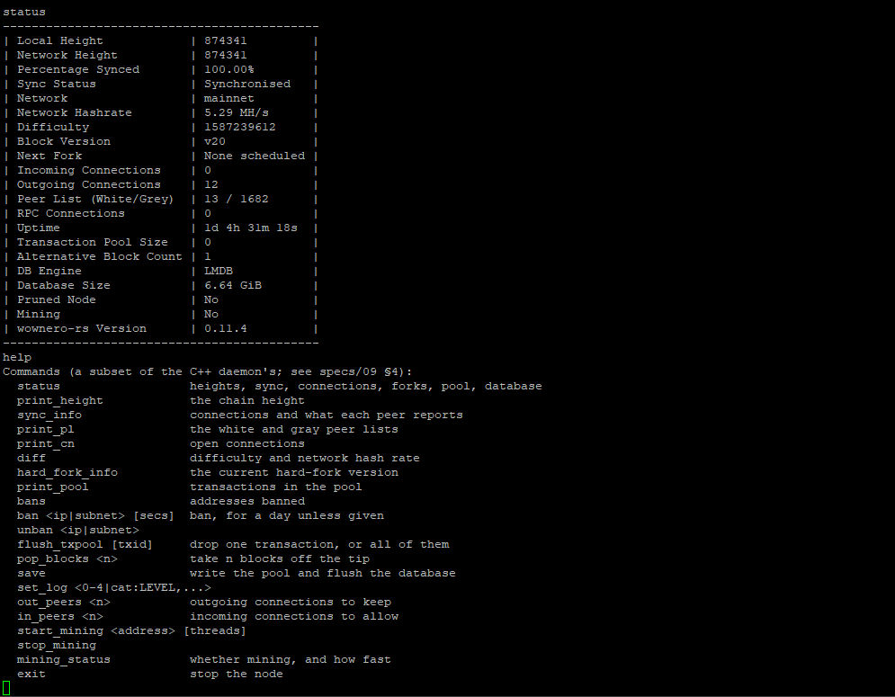
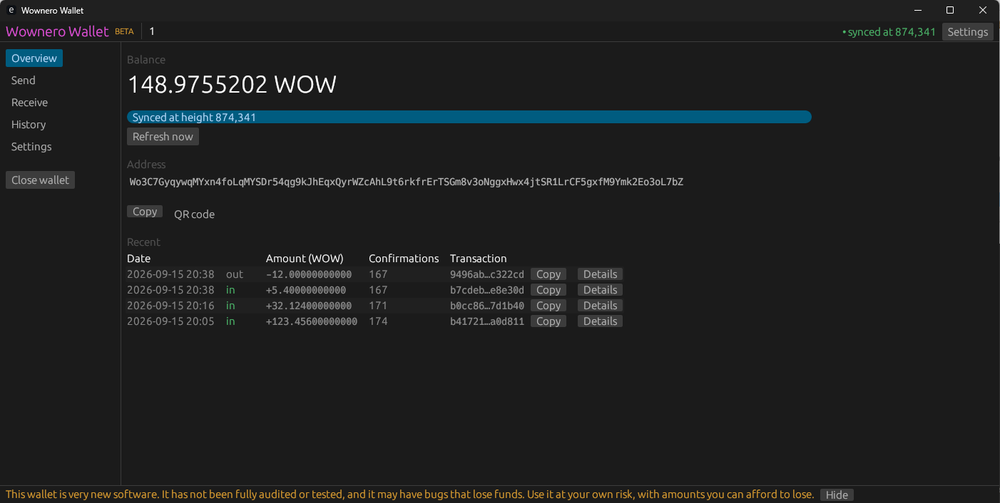
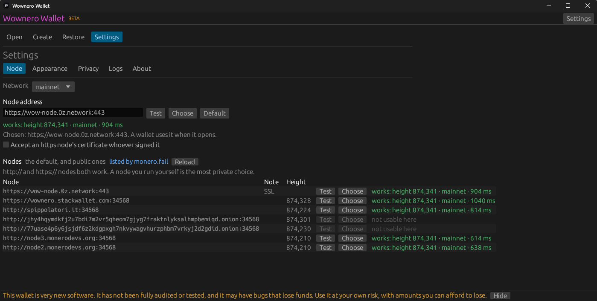
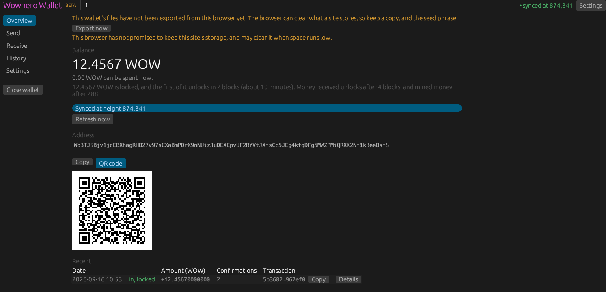
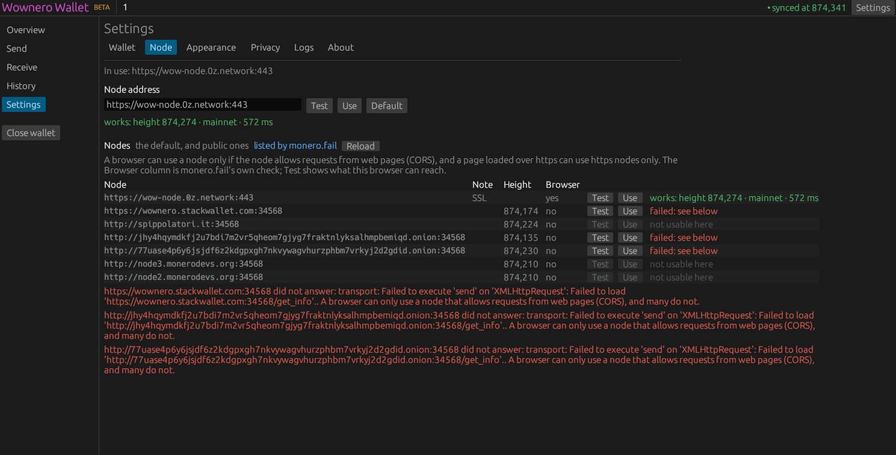

# wownero-rs

A Rust reimplementation of the Wownero suite — daemon, wallet CLI, wallet RPC,
and a desktop and a web wallet — drop-in compatible with the C++ tree at version
`0.11.4.0` "Kunty Karen".

> [!WARNING]
> **Unofficial, AI-assisted and experimental. Use it at your own risk.**
>
> * **Not affiliated with Wownero.** This project is not made, endorsed or
>   maintained by the Wownero project or its developers. The official software
>   lives at [github.com/wownero-project/wownero](https://github.com/wownero-project/wownero).
>   The Wownero name appears here only to say what this code aims to be
>   compatible with. Please don't take problems with this code to the Wownero
>   developers.
> * **Written largely with AI.** Much of the code, tests and documentation was
>   produced with AI coding tools. It can be wrong in ways that look plausible.
> * **Unaudited, and never used with real funds.** Nothing here has been
>   audited, and the send path has never moved real money — see *Status* below
>   for exactly what has and has not been exercised against the live network.
>   It comes with no warranty. Don't use it with a wallet holding funds you
>   can't afford to lose; for real use, run the official Wownero software.

The normative specification is vendored in [`specs/`](specs/). Start with
[`specs/README.md`](specs/README.md), then
[`specs/00-overview.md`](specs/00-overview.md).

> **The one hard requirement:** the Rust node must join the existing Wownero
> mainnet and reach the same chain tip as the C++ node, byte-for-byte, without a
> fork. Everything else is an implementation choice. Consensus is not.

## What it looks like

**`wownerod` on mainnet.** The requirement above, in practice: the Rust node on
the real chain, at the same height as the C++ peers it follows, and staying
there. A day and a bit of uptime, twelve outgoing peers, 1,682 addresses
learned, and 6.64 GiB of LMDB written in the C++ daemon's own format. The
`help` under it is the command set the interactive prompt takes.



**The desktop wallet** — `extras/wallet-gui`, written with egui, over the same
wallet library `wownero-wallet-cli` uses. A balance on mainnet, and a payment
out that this wallet code built, signed and relayed, confirmed 167 blocks deep.



Both wallets choose a node the same way: the default over TLS, then the public
nodes monero.fail lists, each one asked what it is — height, network, latency —
before anything trusts it.



**The web wallet** — `extras/wallet-web`, the same interface compiled to wasm.
Static files and nothing else: no server code and no proxy, the browser talking
straight to a node. Wallets live in the browser's IndexedDB, which the browser
may clear, so it says so until they have been exported. Here it is watching a
receive land.



In a browser a node must also allow requests from web pages, so the node list
grows a Browser column and says in full why each one could not be reached.



Both are in [`extras/`](extras/README.md), a Cargo workspace of its own, so the
node and the command-line wallets never build egui or wasm-bindgen.

## Status

| Milestone | Scope | State |
|---|---|---|
| **M1** | Wire parity: crypto primitives, serialization, block/tx types, hashes, RandomWOW | **complete; gate met** |
| **M2** | Verifying sync on mainnet (PoW, difficulty, LMDB store) | **synced to the mainnet tip** from live C++ peers, into LMDB; CryptoNight v2/v4 missing, so blocks below the last checkpoint are taken on its word |
| **M3** | Serving node (daemon RPC, mempool, P2P) | **built, and now running on mainnet**: inbound and outbound P2P, sync from several peers at once, IPv6, Dandelion++ relay, reorgs, admin RPC and login, RPC over TLS. Over a day at the tip with twelve outgoing peers; inbound peers and the rest still only between local daemons |
| **M4** | Wallet (CLI, RPC, desktop GUI, web) | **built, and it has moved real money**: a payment signed, relayed and confirmed on mainnet, and a receive watched land |
| M5 | Mining and the long tail | **mining built** (templates, the HF 18 signing miner, `generateblocks`), exercised on regtest only; of the long tail, only the ZMQ RPC and publisher are built |

### Verified against the live network

Against public nodes — `https://wow-node.0z.network:443`,
`node2.monerodevs.org:34568` — and the mainnet seed nodes:

* **Wallet** — create, restore from seed (same address reproduced), refresh,
  balance, address, subaddresses and history, in all four front ends:
  `wownero-wallet-cli`, `wownero-wallet-rpc`, the desktop GUI and the web
  wallet.
* **Sending real money** — a payment built, signed, relayed and confirmed on
  mainnet, and a receive watched land in another wallet. The screenshots above
  are of that.
* **Ring construction** — the output distribution (2.9 M RingCT outputs) and
  ring members fetched and well formed. This is what a *send* depends on.
* **Relay** — `/send_raw_transaction` answers, and refuses a malformed
  transaction as a structured value rather than a transport error.
* **Node sync** — `wownerod` handshakes with C++ peers, applies blocks
  continuously, and has reached and held the network's tip: a full mainnet
  chain of its own in LMDB, 6.64 GiB at height 874,341. Proofs of work are
  checked above the last checkpoint only, until CryptoNight v2 and v4 land.
  Above it every rule is enforced, transactions included: each one's ring
  signatures, range proof, commitment sum and ring members are checked with the
  same code that guards the pool, a whole sync batch at a time on every core.
  A sync from scratch is many hours — roughly 11 blocks/s, ~78% of it waiting
  on the peer — so point a wallet at a public node unless you specifically want
  your own chain.

Run the live checks yourself:

```sh
WOW_LIVE_NODE=node2.monerodevs.org:34568   cargo test -p wow-daemon-client --test live_node -- --ignored --nocapture
```

**Not verified:** sweeps — `sweep_all`, and sweeping a single output. Both are
built; neither has been run against mainnet.

**Built, and run on mainnet:** `wownerod --serve` as a long-running node —
outbound peers, syncing from several at once, fluffy blocks, the peer store, and
at least one alternative block filed off the main chain.

**Built, but still only exercised between local daemons:** inbound peers, IPv6,
Dandelion++ relay, reorgs, the admin and mining RPC, HTTP Digest login, RPC over
TLS, the ZMQ RPC and publisher — and the miner, on regtest.

**Not built:** in the web wallet, a daemon login — a browser's `fetch` does
not do HTTP Digest, so a node started with `--rpc-login` is out of reach from
one; the other three front ends can log in. In the wallets, transaction
proofs, key-image import/export and multiple accounts; in the daemon, proxies and i2p/Tor, rate limits, pruning,
bootstrap daemons, background mining, extra messages in mined blocks, and ZMQ
over `ipc://` or with CURVE/PLAIN security. The daemon's `--help` names what is
missing rather than accepting options it cannot honour.
[`docs/daemon-review.md`](docs/daemon-review.md) tracks the daemon review item
by item, with the known gaps in what is built.

### What M1 has

* **`wow-crypto`** — Keccak-256 (original padding), the CryptoNote
  `ge_fromfe_frombytes_vartime` hash-to-curve, ed25519 with Monero's decoding
  rules, key derivation, view tags, subaddresses, Schnorr and v1 ring
  signatures, base58, and 25-word mnemonics in all 13 languages.
  **All 5,545 vectors from the reference tree's `tests/crypto/tests.txt` pass.**
* **`wow-serialize`** — the consensus binary archive and epee portable storage,
  with both varint encodings kept strictly apart.
* **`wow-types`** — blocks, transactions, RingCT, `tx_extra`, addresses,
  weights, difficulty, and every hash in
  [`specs/05`](specs/05-blocks-and-transactions.md) §3–§4. Validated against
  real mainnet blocks: block ids, coinbase hashes, Merkle roots and blob
  round-trips. **Every HF 18+ block's header signature verifies** against the
  computed `sig_data` and the Schnorr verifier, which is the Wownero-specific
  rule ([`specs/06`](specs/06-consensus-rules.md) §4) and checks most of the
  stack at once.
* **`wow-randomwow`** — RandomWOW in Rust, replacing an FFI binding to the
  pinned C++ library: the Argon2d Cache, SuperscalarHash (compiled to machine
  code on x86-64), the VM with RandomX's rounding modes emulated in software,
  seed-hash epochs, and the cache/dataset/VM lifecycle. **Under upstream's
  parameters it reproduces upstream RandomX's published hashes, and under
  Wownero's the hashes the C++ library computed**, which checks the algorithm
  and the parameters separately. The one change the fork makes outside
  `configuration.h`, its `AesGenerator4R` keys, is
  [`docs/spec-deltas.md`](docs/spec-deltas.md) §25. **Hashes 26 real mainnet
  blocks and every one satisfies its own recorded chain difficulty** (1.0e8 –
  9.2e9), which validates the seed arithmetic, the hashing blob and the
  parameters together. A light-mode hash takes about 75 ms on a 16-thread
  desktop, where the C++ took 19 ms with its JIT; sync makes up for it by
  hashing each batch on every core.

### What M1 still needs

Nothing. The gate in [`specs/15`](specs/15-testing-and-conformance.md) §2 is
met: **9,189 mainnet blocks** across every hard-fork era round-trip and
hash-match, and the 1,893 of them at HF 18+ have their header signatures
verified.

The corpus itself is generated rather than committed, since it is a few hundred
MB:

```sh
python scripts/fetch-corpus.py --daemon 127.0.0.1:34568   # or a public node
cargo test -p wow-types --test roundtrip
```

`mainnet_block_corpus` skips with an explanatory message when it is absent, so a
fresh checkout still builds. A 21-block HF 18+ fixture **is** committed
(`tests/corpus/blocks/hf18/`) and carries the header-signature check, so the
most Wownero-specific rule is covered without generating anything.

### What M2 has

* **`wow-consensus`** — the whole of
  [`specs/06`](specs/06-consensus-rules.md) and
  [`specs/07`](specs/07-difficulty.md) as pure functions over values the caller
  has already fetched: no storage, no network, no clock.
  * **All six difficulty algorithms** reproduce real mainnet windows exactly,
    including v2's floating point, v3's inverted clamp, v4's timestamp
    monotonisation, v5's `ts[0] - target` seed and the ten hard-coded overrides.
  * Emission and the block-weight penalty, including the two-step division.
  * **The long-term block weight model**, replayed against the chain's own
    stored column over **170,000 blocks from genesis**, both one-step and
    closed-loop. A 40-row probe across the HF 20 switch settles which
    hard-fork version the stored weight uses
    ([`docs/spec-deltas.md`](docs/spec-deltas.md) §13) — the earlier forks
    provably cannot, because their clamp never binds on a Wownero-sized block.
  * Fees: the dynamic base fee in all four regimes, `check_fee` with its 2%
    buffer, and the four 2021-scaling tiers.
  * Hard-fork tables, the 39 checkpoints, timestamp rules and adjusted time.
  * Coinbase and transaction validation — ring sizes, output types, version
    bounds, sorted inputs, minimum age, RingCT type gating, and the HF 16–17
    dynamic coinbase unlock **checked against real blocks**.

* **`wow-storage`** — the LMDB layer, byte-compatible with the C++ `data.mdb`
  ([`specs/10`](specs/10-storage-lmdb.md)). All nineteen sub-databases open with
  their exact flags and comparators, every record type in §4 encodes and decodes
  byte-for-byte, and the environment reproduces `BlockchainLMDB::open` — paths,
  `--db-sync-mode` flags, map-size arithmetic, the `hf_starting_heights` drop,
  and the schema-version check.

  Built in the order [`specs/15`](specs/15-testing-and-conformance.md) §3.3
  insists on, comparators first. A wrong `compare_hash32` corrupts nothing and
  fails nothing — it just puts every record where `wownerod` will not look — so
  it is checked twice: as a function, and then against a real LMDB cursor walk
  that proves the ordering differs from bytewise in the direction the C++
  requires.

  The `BlockchainDb` trait (§9) is the seam the spec asks for, kept object-safe
  so `wow-core` can hold an `Arc<dyn BlockchainDb>` and a test double can stand
  in for LMDB. The §5 semantics the format *cannot* enforce are implemented and
  tested: the coinbase-first id assignment order, ids as table entry counts
  rather than stored counters, and the commitment rules — including that a v2
  coinbase output is filed under **amount zero** with an identity-mask
  commitment, and that an RCT type 8 commitment is multiplied by eight on the
  way in because the wire form is `C/8`. The LMDB implementation of the trait
  landed with `wow-core`; the 6.64 GiB of mainnet chain in the screenshot above
  is it.
* **`wow-p2p`** — the Levin codec, peer list and block sync
  ([`specs/08`](specs/08-p2p.md)), which grew into the whole node under M3.
* **`wow-core`** — the `Blockchain` state machine that drives all of the above:
  validation, alternative chains and reorgs.

### What M2 still needs

* **CryptoNight v2 and v4**, to verify pre-HF-13 proofs of work from genesis.
  [`specs/03`](specs/03-pow.md) §2 allows deferring it this far, and a node that
  syncs from a checkpoint never needs it — which is how the node in the
  screenshot reached the tip. The gap is explicit rather than silent: a
  pre-HF-13 proof that is not skipped returns
  `PowError::CryptoNightNotImplemented` instead of being waved through, since a
  node that quietly skipped those would sync a chain nobody else agrees with.

  **v0 and v1 are done.** v0 never mined a block — Wownero's genesis is already
  major version 7 — but it derives the wallet-file key
  ([`specs/02`](specs/02-crypto.md) §7), which is the first thing standing
  between a Rust wallet and a `.keys` file the C++ wallet wrote. v1 is the
  chain's own, for HF 7–8. They pass the reference tree's four `tests-slow.txt`
  vectors and the five in `tests-slow-1.txt`, and each of BLAKE-256, Grøstl-256,
  JH-256 and Skein-256 passes its own 321. `tests-slow-2.txt` and
  `tests-slow-4.txt` are vendored and waiting.

The M2 gate is a full mainnet sync **from genesis** with zero differ mismatches.
The node reaches the tip today by taking the checkpoints below HF 13 on trust,
so the gate stays open until v2 and v4 land.

## Layout

Mostly [`specs/00-overview.md`](specs/00-overview.md) §4.1. Three crates the
spec does not name were added as the work went on — `wow-log`, `wow-zmq` and
`wow-tls`, each replacing something that would otherwise have been a
dependency. Two the spec *does* name are still empty, and what they were meant
to hold went elsewhere; the note under the listing says where.

```
crates/
  wow-crypto/        hashing, ed25519, key derivation, view tags, base58, mnemonics, H/commitments
  wow-serialize/     binary archive (consensus) + epee portable storage + varints
  wow-types/         Block, Transaction, RctSig, addresses, difficulty
  wow-randomwow/     RandomWOW in Rust; SuperscalarHash JIT on x86-64 [M1/M2]
  wow-consensus/     emission, weights, fees, difficulty, hard forks
  wow-storage/       BlockchainDb + LMDB, byte-compatible data.mdb
  wow-core/          Blockchain: validation, alternative chains, reorgs
  wow-p2p/           levin, peer lists, multi-peer sync, the node, Dandelion++
  wow-zmq/           ZMTP 3.1 without libzmq: REP/PUB servers, REQ/SUB clients
  wow-log/           C++-style log levels and categories, file rotation
  wow-tls/           a rustls CryptoProvider of pure-Rust crates; no ring
  wow-rpc-types/     empty; see below
  wow-rpc-server/    empty; see below
  wow-wallet/        wallet core: keys, scanning, selection, building, files
  wow-daemon-client/ wallet-side daemon RPC client, with TLS and a login
bin/
  wownerod/  wownero-wallet-cli/  wownero-wallet-rpc/
extras/              a Cargo workspace of its own; see extras/README.md
  wallet-gui/        the desktop wallet on egui: Linux, Windows, macOS
  wallet-web/        the same interface as wasm: static files, no server
tests/corpus/        test vectors and blobs; see tests/corpus/README.md
scripts/             corpus generation, and scripts/check-no-c.sh
docker/              release builds: linux, windows, macos, android
```

`wow-rpc-types` and `wow-rpc-server` are still the placeholders `specs/00` §4.1
asks for, and the daemon's RPC did not land in them: it is
[`bin/wownerod/src/rpc/`](bin/wownerod/src/rpc/), because nothing else needs to
serve it and splitting it out would have meant a crate whose only caller is one
binary. The wallet side's types live with the client that uses them, in
`wow-daemon-client`. The two crates are kept rather than deleted so the
difference from the spec is visible instead of silent.

## Building and testing

```sh
cargo build --workspace
cargo test  --workspace          # ~30 s, dominated by the 5,545 crypto vectors
cargo clippy --workspace --all-targets -- -D warnings
cargo fmt --all --check

# Slow checks, excluded from the default run:
cargo test -p wow-randomwow --release -- --ignored   # ~2.3 GiB dataset build
```

The desktop and web wallets are built separately, in Docker or by hand:
[`extras/README.md`](extras/README.md) has both.

A Rust toolchain and a C compiler are all it needs. LMDB, built by
`lmdb-master-sys`, is the only code in the node and the command-line wallets
that is not Rust; RandomWOW, which used to need CMake and a C++ toolchain, is
Rust now. The desktop wallet adds one more on Linux — `wayland-backend`
compiles a small shim, reached from eframe's defaults — and nothing else
anywhere compiles C. That is checked rather than asserted:

```sh
bash scripts/check-no-c.sh   # also a CI job; per target, both workspaces
```

The workspace pins `opt-level = 3` for dependencies even in the test profile:
an unoptimised `curve25519-dalek` makes the vector suite take minutes rather
than seconds, and [`specs/15`](specs/15-testing-and-conformance.md) §6 budgets
under five minutes for it. `wow-crypto` and `wow-randomwow` get the same in the
dev profile too, since unoptimised proof-of-work makes a debug node unable to
follow the chain.

## Working on this

Three rules, in order of importance.

**1. The C++ tree is the specification where the two disagree.** The spec
documents cite `src/...` paths in the reference tree, not this repository. Keep
a checkout to hand. **Twenty-seven** places where the spec's summary turned out
to be imprecise are collected in [`docs/spec-deltas.md`](docs/spec-deltas.md),
each with the C++ that settles it; they are also flagged at the code that
depends on them.

Findings in the C++ *itself* — as opposed to in the spec's description of it —
go in [`docs/cpp-findings.md`](docs/cpp-findings.md), each with the C++ test
that would confirm it against a real `wownerod` build.

**2. Reproduce the bugs.** [`specs/06`](specs/06-consensus-rules.md) §9 lists
nine inherited quirks that are now consensus. A "cleaner" implementation is a
chain split. Each one this milestone touches has a test naming it.

**3. A parse failure is a `Result`, never a panic.** The epee parser faces the
network before any authentication; a panic there is a remote crash
([`specs/15`](specs/15-testing-and-conformance.md) §4.4). Every parser here has
a `never_panics` test. `wow-crypto`, `wow-serialize` and `wow-types` set
`#![forbid(unsafe_code)]`; `wow-randomwow` cannot, since it uses AES-NI and
runs SuperscalarHash as machine code, so it sets
`#![deny(unsafe_op_in_unsafe_fn)]` and every `unsafe` block carries a `SAFETY`
comment.

## Reference tree

The spec was written against `github.com/wownero-project/wownero` at commit
`9f4f22c72`. To get one:

```sh
git clone https://github.com/wownero-project/wownero.git reference/wownero
git -C reference/wownero checkout 9f4f22c72
git -C reference/wownero submodule update --init external/randomwow
```

## Donate

If any of this was useful to you:

* **Wownero** — `So1e4FFiHd6aizfQRyYBm4Dj3nUgP78Y2Re6iN8HYBSLh2qZTfnJQ6sBnnTJtaPqQFA1z9sKeTJnQ7ZwMzaSzMMRJv1NiHmoB522xXvtS8MQ`
* **Monero** — `4Hh8CAoojaYFZPjA9R7ndGMV6kjLMg1dqKAceg6eJxSp9QUtUpY4Do6QF3931WYSSMVVCY6u6BtCjKMEAzbnZgsmJKJQvfUazBDRK9j4AM`

## Licence

BSD-3-Clause, matching the reference implementation.
